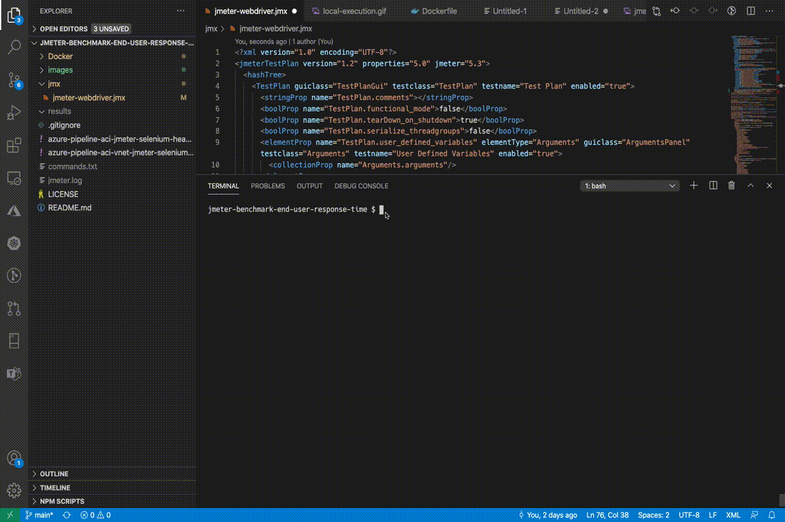

# Execute JMeter + Webdriver tests

This repo has artifacts supporting the blog post (link to be updated) which demonstrates why and how to execute JMeter+Webdriver tests in the following ways:

  * Locally
    
  * Locally from a Docker Container
    
  * From an Azure DevOps Pipeline

## Repository Structure

* The **Docker** folder contains the docker file, which is needed to execute the tests from within a docker container
* The **images** folder contains images used in the post
* The **jmx** folder contains the JMeter [jmeter-webdriver.jmx](./jmx/jmeter-webdriver.jmx) file used in the samples of this post. The original Webdriver Sampler Javascript within this jmx has been taken from [https://www.blazemeter.com/blog/jmeter-webdriver-sampler](https://www.blazemeter.com/blog/jmeter-webdriver-sampler) and then modified
* The azure-pipeline-aci-jmeter-selenium-headless.yml file is used for the third sample of this post where we execute these tests from Azure DevOps using Azure Container Instances
